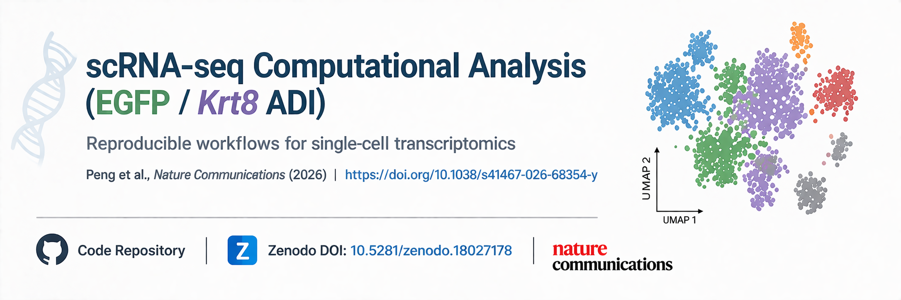

# scRNA-seq Computational Analysis (EGFP / Krt8 ADI)
<p align="center">
  
</p>
This repository contains the computational workflows used for single-cell RNA sequencing (scRNA-seq) analysis described in the following study:

**Peng et al., Nature Communications (2026)**  
*Transcriptomic signature-guided depletion of intermediate alveolar epithelial cells ameliorates pulmonary fibrosis in mice*  
https://doi.org/10.1038/s41467-026-68354-y

All analyses were implemented in Python using Scanpy, SciPy, Seaborn, and Matplotlib.  
No novel algorithms were developed.

---

## Scope of Analysis

### 1. Quality Control and Preprocessing
- Filtering of low-quality cells  
- Mitochondrial content filtering  
- Normalization to 10,000 reads per cell  
- Log-transformation  

### 2. EGFP⁺ Cell Identification
- Based on non-zero expression of EGFP  

### 3. Dimensionality Reduction and Clustering
- PCA  
- kNN graph  
- Leiden clustering (resolution = 0.17)  
- UMAP visualization  

### 3. Dimensionality Reduction and Clustering
- PCA  
- kNN graph  
- Leiden clustering (resolution = 0.17)  
- UMAP visualization  

### 4. Annotation of Krt8⁺ ADI-like Cells
- Based on published criteria (**Peng et al., 2026**)  

### 5. Differential Expression Analysis
- Wilcoxon rank-sum test with correction  

### 6. Transcriptomic Similarity
- Pearson correlation  
- Spearman correlation  
- Cosine similarity  

### 7. Visualization Outputs
- UMAP embeddings  
- Violin plots  
- Dot plots  
- Heatmaps  

---

## Execution Workflow

```bash
python scripts/01_build_tulane_normalized.py
python scripts/02_label_krt8_adi_like.py
python scripts/03_leiden_umap_and_plots.py
python scripts/04_degs_and_similarity.py
```

---

## Script Descriptions

### scripts/01_build_tulane_normalized.py
- Quality control, normalization, log-transformation  
- Outputs processed AnnData object  

### scripts/02_label_krt8_adi_like.py
- EGFP⁺ identification  
- Krt8⁺ ADI annotation  

### scripts/03_leiden_umap_and_plots.py
- PCA, kNN, Leiden clustering  
- UMAP and visualization plots  

### scripts/04_degs_and_similarity.py
- Differential expression  
- Similarity analysis  

---

## Code Availability

The custom Python scripts are publicly available and archived on Zenodo:

https://doi.org/10.5281/zenodo.18027178

---

## Reproducibility

All file paths are defined relative to the project root.

To reproduce:

```bash
python scripts/01_build_tulane_normalized.py
python scripts/02_label_krt8_adi_like.py
python scripts/03_leiden_umap_and_plots.py
python scripts/04_degs_and_similarity.py
```

---

## Requirements

```bash
pip install scanpy scipy seaborn matplotlib
```

---

## Citation

If you use this repository, please cite:

Peng, F., Jiang, C.-S., Zheng, Z., Aliyari, S., Shan, D., Sabharwal, A., Yin, Q., Saito, S., He, C., Rosas, I. O., Lasky, J. A., Thannickal, V. J., & Zhou, Y. (2026).  
*Transcriptomic signature-guided depletion of intermediate alveolar epithelial cells ameliorates pulmonary fibrosis in mice.*  
Nature Communications.  
https://doi.org/10.1038/s41467-026-68354-y

### BibTeX

```bibtex
@article{Peng2026ADI,
  title = {Transcriptomic signature-guided depletion of intermediate alveolar epithelial cells ameliorates pulmonary fibrosis in mice},
  author = {Peng, Fei and Jiang, Chun-sun and Zheng, Zhen and Aliyari, Shahram and Shan, Dan and Sabharwal, Aaryan and Yin, Qinyan and Saito, Shigeki and He, Chao and Rosas, Ivan O. and Lasky, Joseph A. and Thannickal, Victor J. and Zhou, Yong},
  journal = {Nature Communications},
  year = {2026},
  doi = {10.1038/s41467-026-68354-y}
}

@dataset{Aliyari2026Zenodo,
  author = {Aliyari, Shahram and others},
  title = {scRNA-seq computational analysis scripts (EGFP / Krt8 ADI)},
  year = {2026},
  doi = {10.5281/zenodo.18027178},
  publisher = {Zenodo}
}
```
